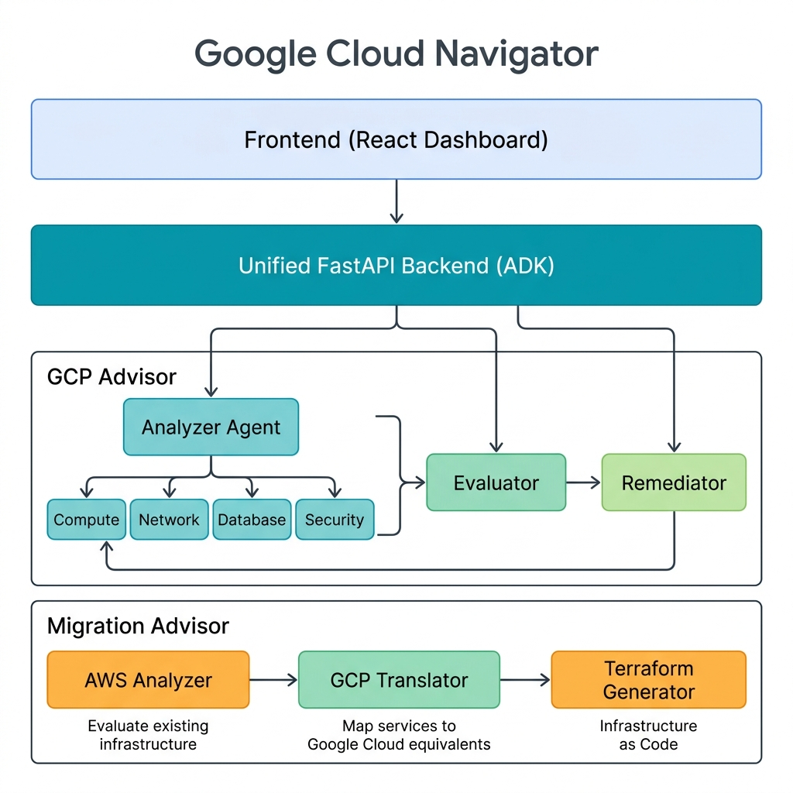

# Google Cloud Navigator

Google Cloud Navigator는 파이썬(FastAPI)과 Node.js(Vite, React)를 기반으로 구축된 AI 에이전트 도구로, Google Cloud 인프라의 유효성을 검사하고 대시보드를 통해 리포트를 제공합니다.




---

## 🤖 핵심 에이전트 기능 상세

Google Cloud Navigator 애플리케이션은 파이썬기반의 두 가지 주요 AI 어드바이저와 하위 서브 에이전트들로 구성되어 협력 동작합니다.

### 🛡️ 1. GCP Advisor (GCP 진단 및 조치 가이드)
현재 인프라의 상태를 스캔하고, Best Practice 체크리스트와 비교하여 진단 및 조치 방안을 제시합니다.

- **Analyzer Agent (분석가)**
  - `GCP Cloud Asset Inventory (CAI)` 등을 조회하여 타겟 프로젝트의 인프라 상태 보고서를 작성합니다.
  - **하위 서브 에이전트 (Sub-Agents)**:
    - 🖥️ **Compute Agent**: Compute Engine, GKE 등 컴퓨팅 자원 분석.
    - 🌐 **Network Agent**: VPC, 방화벽, 로드밸런서 등 네트워크 설정 분석.
    - 🗄️ **Database Agent**: Cloud SQL, BigQuery 등 데이터베이스 및 빅데이터 자원 분석.
    - 🔒 **Security Agent**: IAM 권한, 암호화, 보안 정책 등 분석.

- **Evaluator Agent (평가자)**
  - 인프라 리포트와 사용자가 제출한 체크리스트를 대조하여 규칙 위반 여부(`Matched`, `Mismatch` 등)를 판별하고 판정 근거를 한국어로 명확히 제시합니다.
- **Remediator Agent (조치자)**
  - 불일치나 수동 확인 필요 항목이 발생할 때 적합한 조치 권고 사항 및 Google Cloud Best Practice를 한국어로 제안합니다.

### 🚀 2. Migration Advisor (타사 클라우드 마이그레이션 도우미)
기존 AWS 등 타사 클라우드 아키텍처를 분석하여 Google Cloud 기반으로 아키텍처를 변환하고 자동화 배포 코드를 생성합니다.

- **AWS Analyzer (AWS 아키텍처 분석가)**
  - 기존 타사 클라우드(AWS) 환경의 설정과 아키텍처를 입력받아 분석합니다.
- **GCP Translator (GCP 아키텍처 번역가)**
  - 기존 아키텍처를 분석하여 대응되는 최적의 Google Cloud 서비스로 설계 및 리매핑을 수행합니다.
- **Terraform Generator (테라폼 코드 생성기)**
  - 번역된 Google Cloud 설계안을 바탕으로 자동화된 클라우드 배포 인프라 코드(Terraform)를 생성합니다.

---

## 🏗️ 구동 원리 및 주요 기능

1. **FastAPI 백엔드** (`agents/server.py`):
   - ADK(Agent Development Kit)를 사용하여 백엔드 서버를 초기화하고, 여러 에이전트 폴더를 자동으로 스캔하여 마운트합니다.
   - `Vertex AI` 및 `Cloud Asset Viewer` 등의 권한을 통해 Google Cloud 인프라 데이터를 조회합니다.

2. **React 프론트엔드** (`frontend/`):
   - 사용자에게 설정 화면(Configuration) 및 검증 결과(Checklist, Infra Report)를 보여줍니다.
   - 프론트엔드 빌드 시 필요하면 Nginx 등으로 컨테이너화되어 클라우드에 배포됩니다.

## 📂 폴더 구조

프로젝트는 크게 백엔드 에이전트와 프론트엔드로 나뉩니다.

```text
cloud-agent/
├── agents/             # 백엔드: FastAPI 기반 AI 에이전트 및 API 서버
│   ├── gcp_advisor/    # GCP 진단 로직 및 스트리밍 라우터
│   ├── migration_advisor/ # 마이그레이션 도우미 로직
│   └── server.py       # 통합 백엔드 서버 엔트리포인트
├── frontend/           # 프론트엔드: Vite + React (TypeScript) 대시보드
│   ├── src/            # 리액트 소스 코드
│   └── package.json    # 프론트엔드 종속성 관리
├── deploy/             # 배포 및 실행 스크립트
│   ├── run_local.sh    # 로컬 개발 환경 실행 스크립트
│   └── deploy.sh       # Google Cloud Run 배포 자동화 스크립트
└── TODO.md             # 프로젝트 할 일 및 히스토리
```

---

## 🚀 실행 방법

### 1. 로컬 환경에서 실행하기

`deploy/run_local.sh` 스크립트를 실행하면 백엔드(FastAPI)와 프론트엔드(Vite Dev Server)가 동시에 실행됩니다. 이 스크립트는 가상 환경(`.venv`)을 자동으로 생성하고 종속성을 설치합니다.

```bash
# 워크스페이스 루트에서 실행
./deploy/run_local.sh
```

- **Frontend URL**: `http://localhost:8080`
- **Backend URL**: `http://localhost:8000`

> [!NOTE]
> 실행 전 루트 디렉토리에 `.env` 파일을 복사하여 필요한 환경변수(예: `PROJECT_ID`)를 설정해야 합니다. (`.env.template` 참조)

### 2. Google Cloud (Cloud Run)에 배포하기

`deploy/deploy.sh` 스크립트를 사용하여 백엔드와 프론트엔드 모두 Google Cloud Run에 배포할 수 있습니다. 스크립트 내에서 서비스 어카운트 생성, 권한 부여, 빌드 및 배포가 진행됩니다.

```bash
# 프로젝트 ID 환경변수 설정 후 실행
export PROJECT_ID="your-project-id"
./deploy/deploy.sh
```

---

## 📄 기타 사항
환경 변수 설정 템플릿은 `.env.template`을 참고하세요.

테스트를 위한 인프라 환경 구성
* https://github.com/GoogleCloudPlatform/terraform-google-three-tier-web-app
* https://github.com/GoogleCloudPlatform/microservices-demo/tree/main/terraform


